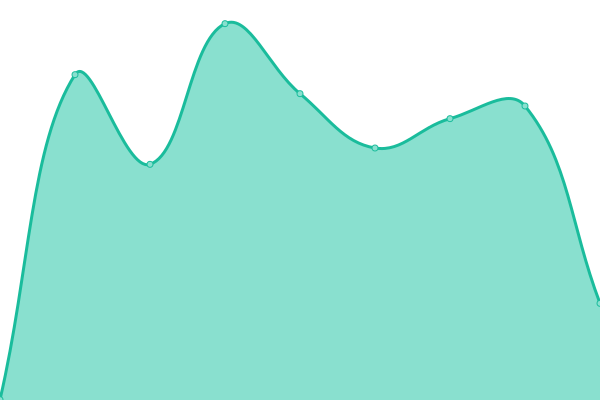

# [📈 Live Status](https://demo.upptime.js.org): <!--live status--> **🟩 All systems operational**

This repository contains the open-source uptime monitor and status page for [Upptime](https://upptime.js.org), powered by [Upptime](https://github.com/upptime/upptime).

With [Upptime](https://upptime.js.org), you can get your own unlimited and free uptime monitor and status page, powered entirely by a GitHub repository. We use [Issues](https://github.com/upptime/statuspage/issues) as incident reports, [Actions](https://github.com/upptime/statuspage/actions) as uptime monitors, and [Pages](https://demo.upptime.js.org) for the status page.

<!--start: status pages-->
<!-- This summary is generated by Upptime (https://github.com/upptime/upptime) -->
<!-- Do not edit this manually, your changes will be overwritten -->
<!-- prettier-ignore -->
| URL | Status | History | Response Time | Uptime |
| --- | ------ | ------- | ------------- | ------ |
|  [Aument.io](https://aument.io/) | 🟩 Up | [aument-io.yml](https://github.com/Compass-data/statuspage/commits/HEAD/history/aument-io.yml) | 

 1042ms
     
 | 

<a href="https://Compass-data.github.io/statuspage/history/aument-io">99.73%</a>
    

|  [Aument App](https://platform.aument.io) | 🟩 Up | [aument-app.yml](https://github.com/Compass-data/statuspage/commits/HEAD/history/aument-app.yml) | 

 264ms
     
 | 

<a href="https://Compass-data.github.io/statuspage/history/aument-app">100.00%</a>
    

|  [Canario](https://canario.shop) | 🟩 Up | [canario.yml](https://github.com/Compass-data/statuspage/commits/HEAD/history/canario.yml) | 

 243ms
     
 | 

<a href="https://Compass-data.github.io/statuspage/history/canario">100.00%</a>
    

|  [rt](https://rtstactical.com) | 🟩 Up | [rt.yml](https://github.com/Compass-data/statuspage/commits/HEAD/history/rt.yml) | 

 937ms
     
 | 

<a href="https://Compass-data.github.io/statuspage/history/rt">100.00%</a>
    

|  [Shopify Accounts](https://accounts.shopify.com/) | 🟩 Up | [shopify-accounts.yml](https://github.com/Compass-data/statuspage/commits/HEAD/history/shopify-accounts.yml) | 

 467ms
     
 | 

<a href="https://Compass-data.github.io/statuspage/history/shopify-accounts">100.00%</a>
    

<!--end: status pages-->

[**Visit our status website →**](https://demo.upptime.js.org)

## 📄 License

- Powered by: [Upptime](https://github.com/upptime/upptime)
- Code: [MIT](./LICENSE) © [Upptime](https://upptime.js.org)
- Data in the `./history` directory: [Open Database License](https://opendatacommons.org/licenses/odbl/1-0/)
